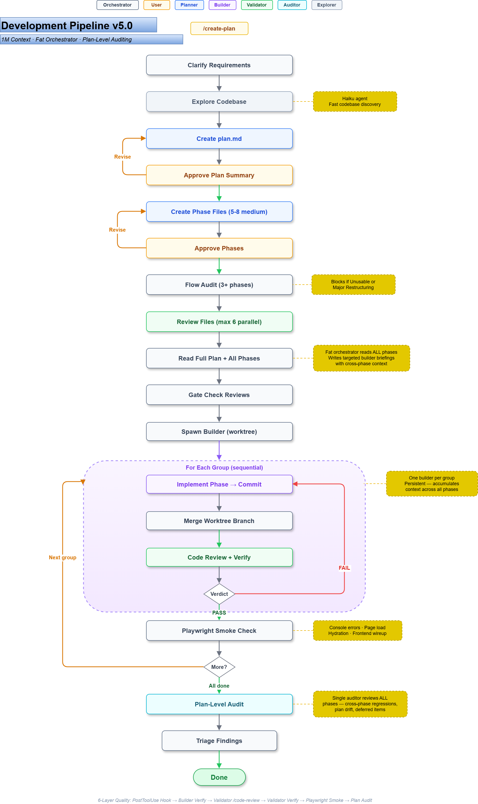

# Claude Code Setup for Next.js / Supabase / TypeScript

A production-ready Claude Code configuration for Next.js/Supabase/TypeScript projects. Includes hooks for automated quality gates, skills for guided workflows, agents for specialized tasks, MCP server integrations, and comprehensive coding rules.

Extracted from a production SaaS codebase and generalized for reuse. All files use `<!-- CUSTOMIZE -->` markers where you need to fill in project-specific details.

---

## Table of Contents

- [What This Provides](#what-this-provides)
- [Development Workflow](#development-workflow)
  - [The Pipeline](#the-pipeline)
  - [Atomic Phases](#atomic-phases)
  - [Team Orchestration](#team-orchestration)
  - [Quality Gates](#quality-gates)
  - [Ad-Hoc Development](#ad-hoc-development)
- [Quick Start](#quick-start)
- [Prerequisites](#prerequisites)
- [Directory Structure](#directory-structure)
- [Hooks](#hooks)
  - [Hook Summary](#hook-summary)
  - [TypeScript Quality Checks](#typescript-quality-checks)
  - [Project-Specific TypeScript Validator](#project-specific-typescript-validator)
  - [Blocked Commands](#blocked-commands)
  - [Additional Validators](#additional-validators)
- [Skills](#skills)
  - [Planning](#planning)
  - [Code Quality](#code-quality)
  - [Document Creation](#document-creation)
  - [Builders](#builders)
  - [Technical](#technical)
  - [MCP Wrappers](#mcp-wrappers)
- [Agents](#agents)
- [Rules](#rules)
- [MCP Servers](#mcp-servers)
  - [Playwright](#playwright)
  - [Context7](#context7)
  - [Tavily](#tavily)
  - [Sequential Thinking](#sequential-thinking)
  - [Draw.io](#drawio)
- [Prompt Caching](#prompt-caching)
- [Customization Guide](#customization-guide)
- [Troubleshooting](#troubleshooting)
- [Plugins](#plugins)
- [Community Addons](#community-addons)
  - [RTK (Rust Token Killer)](#rtk-rust-token-killer)
  - [Claude Ultimate HUD](#claude-ultimate-hud)
- [Research](#research)
- [Acknowledgments](#acknowledgments)
- [License](#license)

---

## What This Provides

| Category | Count | Purpose |
|----------|-------|---------|
| **Hooks** | 11 Python scripts | Automated quality gates, logging, security blocks, context injection |
| **Skills** | 27 slash commands | Guided workflows for planning, building, reviewing, creating diagrams, and using MCP tools |
| **Agents** | 9 agent definitions | Specialized sub-agents for architecture, review, testing, building, auditing, planning |
| **MCP Servers** | 5 integrations | Browser automation, documentation lookup, web search, structured reasoning, diagramming |
| **Rules** | 16 markdown files | Coding standards for TypeScript, React, Supabase, security, testing, and more |

---

## Development Workflow

This setup's primary value is a **structured development pipeline** — from feature idea to shipped code, with quality gates at every stage. Every guardrail exists because skipping it caused hours of rework in real usage.

### The Pipeline

<picture>
  
</picture>

`/implement` now processes phases in **groups** — connected phases that build the same feature area. After each group's phases pass the build/validate cycle, an auditor automatically reviews the group for cross-phase regressions, deferred items, plan drift, and system integrity. Medium/Low issues are auto-fixed; High/Critical issues checkpoint with the user. This catches drift incrementally rather than discovering it after 20 phases.

### Atomic Phases

Traditional development plans have 3-5 large phases. This doesn't work with AI-assisted development because each phase must fit within a single context window (~200K tokens). Large phases cause Claude to lose earlier context mid-implementation, producing incomplete or inconsistent code.

**The rule: 30 small phases > 5 large phases.**

| Wrong | Right |
|-------|-------|
| "Phase 01: Database + API + UI" | Split into 3 separate phases |
| "Phase 02: Full Feature Implementation" | Break into atomic steps |
| "Phase 03: Testing and Polish" | TDD is Step 0 in *every* phase |

Each phase file includes a `skill:` field in its frontmatter specifying which domain skill to invoke — `postgres-expert` for database work, `server-action-builder` for API mutations, `react-form-builder` for forms, and so on. The orchestrator extracts this value and passes it directly to the builder in the spawn prompt, so skill invocation is explicit rather than discovered indirectly. The builder also reads a real reference file from the codebase before writing any code, so patterns are grounded in what actually exists rather than guessed from training data.

### Team Orchestration

Both `/create-plan` and `/implement` use the same **thin dispatcher** pattern — an orchestrator skill that coordinates ephemeral agent teammates via checkpoints and message routing:

| Pipeline | Orchestrator | Ephemeral Agents | Communication |
|----------|-------------|-----------------|---------------|
| **Planning** (`/create-plan`) | Clarifies requirements, relays checkpoints to user, runs structural audit, spawns validators | Planner (creates plan.md + phases), Auditor (runs `/audit-plan`), Validators (run `/review-plan`) | Checkpoints: planner reports plan summary and phase completion for user approval. Audit gates reviews — structural issues block before per-phase review work begins. |
| **Implementation** (`/implement`) | Processes groups sequentially, gate checks, routes verdicts, triages audit findings | Builder (implements one phase), Validator (runs `/code-review`), Auditor (cross-phase group review) | Builder → Validator → (per group) Auditor → orchestrator triages findings |

#### Implementation Team (`/implement`)

| Role | Lifetime | Responsibility |
|------|----------|---------------|
| **Orchestrator** | Entire plan | Processes groups sequentially, gate checks phases, spawns/shuts down agents, routes build/validate verdicts, triages auditor findings (auto-fix Medium/Low, escalate High/Critical to user) |
| **Builder** | One phase (ephemeral) | Full phase implementation in an **isolated git worktree** — receives domain skill from orchestrator, reads phase file, finds references, writes code with TDD, runs tests + typecheck, commits to worktree branch. Orchestrator merges branch before validation. Does NOT review its own code. |
| **Validator** | One phase (ephemeral) | Independent code review via `/code-review` (reference-grounded, with auto-fix), then verification (typecheck + tests + conditional E2E/DB). Reports PASS/FAIL to orchestrator. |
| **Auditor** | One group (ephemeral) | Cross-phase analysis after a group completes — checks regressions, deferred items, plan drift, acceptance criteria. Read-only. Reports severity-rated findings to orchestrator. |

#### Planning Team (`/create-plan`)

| Role | Lifetime | Responsibility |
|------|----------|---------------|
| **Orchestrator** | Entire session | Clarifies requirements with user, spawns planner, runs structural audit, spawns validators, relays checkpoints for user approval, routes review feedback |
| **Planner** | One plan (ephemeral) | Reads templates, explores codebase references, creates plan.md + all phase files, self-validates. Reports at two checkpoints for user course-correction. |
| **Auditor** | One audit (ephemeral) | Runs `/audit-plan` — structural flow audit checking dependencies, ordering, data flow. Bails with "Unusable" if plan is fundamentally broken. Gates per-phase reviews. |
| **Validator** | One file (ephemeral) | Runs `/review-plan` against plan.md or a single phase file. Reports template score + codebase compliance. Only spawned after audit passes. |

**Why agents are ephemeral:** Each task gets a fresh agent with a clean 200K context window. After the work cycle completes, agents are shut down. This prevents context contamination between phases (bad patterns from phase 2 don't bleed into phase 3) and ensures skill instructions are never compacted away.

**Builder worktree isolation:** Each builder runs in an isolated git worktree (`isolation: "worktree"`) with its own branch. This prevents parallel builders from corrupting each other's files. The builder commits to its worktree branch, the orchestrator merges the branch into the main tree, and the validator runs on the merged result. If validation fails, `git revert` cleanly undoes the merge before respawning a fresh builder.

**Context injection:** Teammates don't inherit the parent's full context — file-scoped rules, domain skills, and project patterns must reach agents another way. Five rules with `alwaysApply: true` (git-workflow, mcp-tools, security, date-formatting, domain-patterns) load natively for all teammates. The workflow skills (`builder-workflow`, `validator-workflow`, `auditor-workflow`) each start with a Step 0 that explicitly reads `coding-style.md` and `patterns.md`. `domain-patterns.md` provides compressed critical patterns from all 9 domain skills as passive context — following the [Vercel finding](docs/research/vercel-skills-findings.md) that passive context achieves 100% compliance vs 53-79% for on-demand skill invocation. The orchestrator also extracts the `skill:` field from the phase frontmatter and passes it explicitly in the builder's spawn prompt. See [docs/teams-research.md](docs/teams-research.md) for the full analysis.

The `/implement` orchestrator uses a **batch processing model** with strict concurrency limits:

| Constraint | Limit | Why |
|-----------|-------|-----|
| Builders per batch | Max 2 | Context pressure from parallel completions |
| Validators per batch | Max 2 (one per builder) | Each builder gets one validator |
| **Total active agents** | **Max 4** | Orchestrator context budget |
| Batch overlap | **None** | Wait for current batch to fully complete before spawning next |

The orchestrator scans all pending phases and checks each phase's `dependencies` frontmatter to determine which are unblocked. Up to 2 unblocked phases are spawned as parallel builders (a "batch"), each with its own clean context. As each builder completes, a validator is spawned for its phase. The entire batch must finish — all builders done, all validators done, all verdicts processed — before the orchestrator loops back to find newly unblocked phases. No new builders are spawned mid-batch.

### Quality Gates

Quality is enforced at four layers during each phase, in order:

| Layer | When | What Runs | Catches |
|-------|------|-----------|---------|
| **Global PostToolUse hook** | Every Write/Edit on TS files | `post_tool_use.py` (7 regex checks) | `any` types, missing `server-only`, `console.log`, hardcoded secrets, admin client misuse |
| **Builder verification** | After implementation | `pnpm test` + `pnpm run typecheck` + conditional `pnpm test:e2e` / `pnpm test:db` | Test failures, type errors, E2E regressions, DB test failures |
| **Validator `/code-review`** | After builder reports done | Comprehensive checklist (Code Reuse, Efficiency, TypeScript, Security, RLS, React, Testing), codebase-grounded, auto-fix (independent agent) | Pattern deviations, reinvented utilities, TOCTOU anti-patterns, security issues, missing auth checks |
| **Validator verification** | After code review auto-fixes | `pnpm test` + `pnpm run typecheck` + conditional `pnpm test:e2e` / `pnpm test:db` | Issues introduced by auto-fixes, E2E regressions, DB test failures |

The global `post_tool_use.py` hook runs on all agents via `settings.json` — lightweight regex checks that catch convention violations at write-time without subprocess calls. For projects with TypeScript LSP configured (`tsconfig.json` with paths and the Next.js plugin), the LSP provides real-time type diagnostics as a complementary layer alongside the builder's `tsc --noEmit` verification. To enable the TypeScript LSP:

```bash
# 1. Install the language server
npm install -g typescript-language-server typescript

# 2. Enable the plugin (in ~/.claude/settings.json)
# "enabledPlugins": { "typescript-lsp@claude-plugins-official": true }
```

Once installed, Claude Code gets real-time diagnostics (type errors, missing imports, unused variables) without needing to run `tsc` — the same feedback loop your IDE provides.

Both `/review-plan` (planning phase) and `/code-review` (implementation phase) are **codebase-grounded** — they read actual files from your project before flagging issues, so findings are specific to your codebase rather than generic advice.

Implementation is blocked if:
- Flow audit says "Unusable" or "Major Restructuring Needed" (structural issues must be fixed before reviews even begin)
- Plan review verdict is "No"
- Phase contains placeholder content (`[To be detailed]`, `TBD`)
- Phase review has unresolved Critical/High issues
- Validator returns FAIL 3+ times on the same phase (escalates to user)

### Ad-Hoc Development

Not everything needs a plan. For smaller tasks — bug fixes, single-feature additions, quick refactors — use **`/dev`** instead:

```
/dev add a loading spinner to the projects list
```

`/dev` follows the same principles (find a reference first, invoke the right domain skill, TDD, verify) but skips the planning overhead. It auto-routes to the appropriate domain skill based on what you're building:

| Work Type | Skill Invoked |
|-----------|--------------|
| Database changes | `/postgres-expert` |
| Server actions | `/server-action-builder` |
| Service layer | `/service-builder` |
| React forms | `/react-form-builder` |
| Components/pages | `/vercel-react-best-practices` |
| E2E tests | `/playwright-e2e` |

After verification passes, `/dev` runs `git diff --name-only` to confirm the exact set of files changed before reporting done — useful after context compacts where memory of what was touched may be incomplete.

If a `/dev` task turns out to be too large (10+ files, multiple domains), it recommends switching to `/create-plan` instead.

> For a deep dive into how each skill works internally, see [docs/workflow.md](docs/workflow.md).

---

## Quick Start

### Option A: Symlink to User-Level (Recommended)

This makes skills, agents, and rules available globally across all projects via symlinks from `~/.claude/` to this repo. Edit files in one place, every project benefits.

```bash
# Clone the repo
git clone https://github.com/your-org/my-claude-setup.git ~/Projects/my-claude-setup

# Symlink skills, agents, and rules to user-level
ln -sf ~/Projects/my-claude-setup/.claude/skills ~/.claude/skills
ln -sf ~/Projects/my-claude-setup/.claude/agents ~/.claude/agents
ln -sf ~/Projects/my-claude-setup/.claude/rules ~/.claude/rules

# Copy hooks into each project (hooks stay project-level — they run project-specific validators)
cp -r ~/Projects/my-claude-setup/.claude/hooks your-project/.claude/hooks
cp ~/Projects/my-claude-setup/.claude/settings.json your-project/.claude/settings.json
cp ~/Projects/my-claude-setup/CLAUDE.md your-project/CLAUDE.md
```

Add MCP servers to your user-level config (`~/.claude.json`):

```json
{
  "mcpServers": {
    "playwright": {
      "command": "npx",
      "args": ["@playwright/mcp@latest"],
      "env": {}
    },
    "sequential-thinking": {
      "command": "npx",
      "args": ["-y", "@modelcontextprotocol/server-sequential-thinking"],
      "env": {}
    },
    "context7": {
      "command": "npx",
      "args": ["-y", "@upstash/context7-mcp", "--api-key", "YOUR_CONTEXT7_API_KEY"]
    },
    "tavily": {
      "command": "npx",
      "args": ["-y", "tavily-mcp@latest"],
      "env": { "TAVILY_API_KEY": "YOUR_TAVILY_API_KEY" }
    },
    "drawio": {
      "command": "npx",
      "args": ["-y", "@next-ai-drawio/mcp-server@latest"]
    }
  }
}
```

### Option B: Copy Per-Project

Copy everything into each project individually. Simpler setup, but updates must be applied to every project.

```bash
cp -r .claude/ your-project/.claude/
cp .mcp.json.example your-project/.mcp.json
cp CLAUDE.md your-project/CLAUDE.md
# Edit your-project/.mcp.json and add your API keys
```

### After Either Option

1. **Run `/customize`** to fill in project-specific details. This onboarding wizard collects your project info (name, commands, architecture, component library, etc.) and fills all `<!-- CUSTOMIZE -->` markers across CLAUDE.md and rule files automatically. Or search for markers manually with `grep -rn "CUSTOMIZE" CLAUDE.md .claude/rules/`.

2. **Start Claude Code** in your project directory. The hooks, skills, and rules load automatically.

---

## Prerequisites

| Dependency | Version | Purpose |
|------------|---------|---------|
| [Node.js](https://nodejs.org/) | 18+ | Running MCP servers via `npx` |
| [Python](https://www.python.org/) | 3.11+ | Running hook scripts |
| [uv](https://docs.astral.sh/uv/) | Latest | Python script runner (used by all hooks) |
| [Claude Code](https://docs.anthropic.com/en/docs/claude-code) | Latest | CLI that reads this configuration |

Optional:
- [Playwright browsers](https://playwright.dev/) for the Playwright MCP server
- [curl](https://curl.se/) for sound notifications (used by the notification utility)

---

## Directory Structure

```text
.claude/
├── agents/                         # 9 agent definitions
│   ├── architect.md                # Architecture design and trade-off analysis
│   ├── code-quality-reviewer.md    # Code quality and pattern compliance
│   ├── doc-updater.md              # Documentation maintenance
│   ├── security-reviewer.md        # Security vulnerability detection
│   ├── tdd-guide.md                # Test-Driven Development specialist
│   └── team/
│       ├── auditor.md              # Read-only group auditor (cross-phase analysis)
│       ├── builder.md              # Focused implementation agent
│       ├── planner.md              # Ephemeral planning agent
│       └── validator.md            # Task verification and auto-fix agent
├── hooks/                          # 11 Python hook scripts
│   ├── config/
│   │   └── blocked-commands.json   # Dangerous command patterns to block
│   ├── notification.py             # Sound alerts for user-action-needed events
│   ├── post_tool_use.py            # Quality checks after Write/Edit on TS files
│   ├── post_tool_use_failure.py    # Actionable guidance after tool failures
│   ├── pre_compact.py              # Transcript backup before context compaction
│   ├── pre_tool_use.py             # Blocks dangerous commands, logs tool calls
│   ├── session_end.py              # Logs session end, plays completion sound
│   ├── session_start.py            # Injects git branch/status into context
│   ├── stop.py                     # Transcript export + completion sound
│   ├── user_prompt_submit.py       # Logs prompts, stores for status display
│   ├── logs/                       # JSONL append-only logs (gitignored, grep-able across sessions)
│   ├── utils/
│   │   ├── constants.py            # Shared paths, log directory helpers, JSONL logging
│   │   └── notify.py               # Sound notification via HTTP (optional)
│   └── validators/
│       ├── typescript_validator.py  # Project-specific TS pattern checks (customisation template, not active by default)
│       ├── validate_file_contains.py    # Checks files contain required sections
│       ├── validate_new_file.py         # Checks a new file was created
│       ├── validate_no_placeholders.py  # Detects placeholder/skeleton content
│       └── validate_tdd_tasks.py        # Enforces TDD task ordering in plans
├── rules/                          # 16 rule files
│   ├── admin.md                    # Admin operations guidelines
│   ├── coding-style.md             # TypeScript/React coding standards
│   ├── database.md                 # Supabase/Postgres patterns and RLS
│   ├── date-formatting.md          # Date parsing (YYYY-MM-DD as local time, not UTC)
│   ├── domain-patterns.md          # Compressed domain skill patterns (passive context for agents)
│   ├── forms.md                    # Form handling with react-hook-form + Zod
│   ├── git-workflow.md             # Branch strategy and commit conventions
│   ├── i18n.md                     # Internationalization patterns
│   ├── mcp-tools.md                # MCP server usage guide
│   ├── pages-and-layouts.md        # Next.js page and layout conventions
│   ├── patterns.md                 # Data fetching, mutations, service patterns
│   ├── pre-implementation-analysis.md  # Blast radius, security, and pattern checks before writing code
│   ├── route-handlers.md           # API route handler conventions
│   ├── security.md                 # RLS, secrets, auth, multi-tenant isolation
│   ├── testing.md                  # Vitest, mocking, TDD workflow
│   └── ui-components.md            # Component library usage guidelines
├── skills/                         # 27 skill directories (each with SKILL.md)
│   ├── auditor-workflow/
│   ├── audit-plan/
│   ├── builder-workflow/
│   ├── cache-audit/
│   ├── code-review/
│   ├── context7-mcp/
│   ├── customize/
│   ├── create-plan/
│   ├── dev/
│   ├── drawio-mcp/
│   ├── implement/
│   ├── improve-prompt/
│   ├── playwright-e2e/
│   ├── playwright-mcp/
│   ├── planner-workflow/
│   ├── postgres-expert/
│   ├── react-form-builder/
│   ├── review-plan/
│   ├── sequential-thinking-mcp/
│   ├── server-action-builder/
│   ├── service-builder/
│   ├── tavily-mcp/
│   ├── validator-workflow/
│   ├── vercel-composition-patterns/
│   ├── vercel-react-best-practices/
│   ├── vercel-react-native-skills/
│   └── web-design-guidelines/
├── settings.json                   # Hook configuration and environment
├── settings.local.json.example     # Template for local overrides (gitignored)
docs/
├── workflow.md                     # Detailed pipeline workflow documentation
└── research/                       # Research documents (see Research section)

.mcp.json.example                   # Example MCP server definitions (copy and add API keys)
CLAUDE.md                           # Main project instructions
```

---

## Hooks

All hooks are Python scripts executed via `uv run`. They are configured in `.claude/settings.json` and run automatically at the appropriate lifecycle points.

### Hook Summary

| Hook | Script | Trigger | What It Does |
|------|--------|---------|--------------|
| **PreToolUse** | `pre_tool_use.py` | Before any tool call | Blocks dangerous Bash commands (configurable). Logs a structured summary of every tool call. JSONL append-only log for cross-session analysis. |
| **PostToolUse** | `post_tool_use.py` | After any tool call | Runs 7 quality checks on TypeScript files after Write/Edit (see table below). Injects warnings into Claude's context. Trims oversized MCP outputs. JSONL logging. |
| **PostToolUseFailure** | `post_tool_use_failure.py` | After a tool call fails | Pattern-matches error messages and injects actionable guidance (e.g., "Read file before Edit", "Don't retry denied commands"). |
| **Notification** | `notification.py` | When Claude needs input | Plays a sound for permission prompts and elicitation dialogs. Ignores idle/auth events. |
| **Stop** | `stop.py` | When Claude stops | Exports JSONL transcript to `chat.json`. Plays completion sound. JSONL logging. |
| **PreCompact** | `pre_compact.py` | Before context compaction | Logs compaction events. Optionally backs up the transcript before compression. |
| **UserPromptSubmit** | `user_prompt_submit.py` | When user submits a prompt | Logs prompt metadata. Stores prompt text in session file for status display. |
| **SessionStart** | `session_start.py` | When a session begins | Injects current git branch and uncommitted file count into Claude's context. Logs session start. |
| **SessionEnd** | `session_end.py` | When a session ends | Logs session end reason. Plays completion sound. |

### TypeScript Quality Checks

The `post_tool_use.py` hook runs 7 regex-based quality checks on `.ts`/`.tsx` files after every Write/Edit. No subprocess calls to `tsc` or `eslint` — these are fast pattern matches that catch convention violations immediately at write-time.

**Checks performed:**

| # | Category | Check | Applies To |
|---|----------|-------|------------|
| 1 | TypeScript Safety | `console.log`/`console.error` usage | All non-test `.ts`/`.tsx` files |
| 2 | Server/Client Boundary | Missing `import 'server-only'` in server files | Files in `server-actions`, `service`, `loader`, `_lib/server/`, `api` paths |
| 3 | TypeScript Safety | `any` type usage (`: any`, `as any`, `<any>`) | All non-test `.ts`/`.tsx` files |
| 4 | Server/Client Boundary | React hooks without `'use client'` directive | `.tsx` files using hooks (not server files) |
| 5 | Code Style | Default exports on non-page/layout components | `_components/` and `components/` `.tsx` files |
| 6 | Security | Hardcoded secrets (API keys, JWT tokens, Stripe keys, GitHub PATs) | All `.ts`/`.tsx` files |
| 7 | Security | Service-role/admin Supabase client without justification comment | All `.ts`/`.tsx` files |

Test files (`__tests__/`, `.test.ts`, `.test.tsx`) and generated files (`database.types`, `.gen.`) are skipped entirely.

<!-- CUSTOMIZE: To add project-specific checks (e.g., framework wrapper enforcement, naming conventions),
add them to the check_typescript_quality() function in post_tool_use.py. Keep checks lightweight
(regex only, no subprocess calls) and use break-after-first-match to limit noise. -->

### Project-Specific TypeScript Validator

The `validators/typescript_validator.py` is a **customisation template** for project-specific pattern checks that go beyond the global hook. It ships with all checks commented out — you uncomment and adapt the patterns that match your project:

- Wrong import paths (e.g., direct `@supabase/` imports when you have a wrapper package)
- Missing framework wrappers (e.g., auth wrappers on server actions)
- Naming conventions (e.g., `Action` suffix on server action exports)
- Component library compliance (e.g., flagging `@mui/` when your project uses Fluent UI)

To enable it for specific agents, add a `PostToolUse` hook to the agent's frontmatter in `.claude/agents/`:

```yaml
hooks:
  PostToolUse:
    - matcher: "Write|Edit"
      hooks:
        - type: command
          command: >-
            uv run $CLAUDE_PROJECT_DIR/.claude/hooks/validators/typescript_validator.py
```

By default, it is **not active on any agents** — this avoids wasting tokens on empty checks. Only enable it after you've customised the checks for your project.

### Blocked Commands

The `pre_tool_use.py` hook reads patterns from `.claude/hooks/config/blocked-commands.json`. Each rule has:
- `pattern` -- regex to match against the Bash command
- `safe_patterns` -- regexes that whitelist specific usages (e.g., `rm -rf .next` is allowed)
- `action` -- `"deny"` (hard block) or `"ask"` (prompt user for permission)
- `reason` -- explanation shown to Claude

**Default blocked commands:**

| Command Pattern | Action | Reason |
|----------------|--------|--------|
| `rm -rf` on unrecognized paths | Ask | Could destroy source code or data |
| `git push --force` (without `--force-with-lease`) | Deny | Overwrites remote history |
| `DROP TABLE` | Ask | Permanently destroys table and data |
| `DROP DATABASE` | Deny | Destroys entire database |
| `TRUNCATE` | Ask | Removes all rows with no rollback |

You can add your own rules by editing `blocked-commands.json`.

### Additional Validators

The `validators/` directory contains reusable validators that skills and agents can invoke:

| Validator | Purpose |
|-----------|---------|
| `validate_file_contains.py` | Checks that a file contains required sections (e.g., plan documents must have specific headings) |
| `validate_new_file.py` | Checks that at least one file with a given extension exists in a directory |
| `validate_no_placeholders.py` | Detects placeholder content like `[To be detailed]`, `TBD`, `TODO: flesh out` |
| `validate_tdd_tasks.py` | Enforces that TDD/testing tasks appear before implementation tasks in plan documents |

---

## Skills

Skills are invoked via slash commands (e.g., `/create-plan`) or the `Skill` tool. Each skill has a `SKILL.md` file that provides structured guidance, checklists, and examples.

### Setup

| Skill | Slash Command | Purpose |
|-------|--------------|---------|
| **customize** | `/customize` | Onboarding wizard — collects project details and fills all `<!-- CUSTOMIZE -->` markers across CLAUDE.md and rule files |

### Planning

| Skill | Slash Command | Purpose |
|-------|--------------|---------|
| **create-plan** | `/create-plan` | Orchestrates plan creation — spawns an Explore agent for codebase grounding, then an ephemeral planner agent with user checkpoints, then validators for review |
| **audit-plan** | `/audit-plan` | Structural flow audit — dependencies, ordering, data flow. Runs BEFORE reviews; bails on fundamentally broken plans |
| **review-plan** | `/review-plan` | Per-phase template + codebase compliance review. Runs AFTER audit passes |
| **implement** | `/implement` | Executes implementation phases from a plan (handles TDD, coding, review loop) |

### Code Quality

| Skill | Slash Command | Purpose |
|-------|--------------|---------|
| **code-review** | `/code-review` | Structured code review with severity-rated findings, file:line references, and fix suggestions |
| **improve-prompt** | `/improve-prompt` | Refines and improves user prompts for better Claude Code results |
| **cache-audit** | `/cache-audit` | Audits your setup for prompt caching efficiency -- checks prefix stability, hook patterns, dynamic content size, rule duplication, and token budget |

### Document Creation

| Skill | Slash Command | Purpose |
|-------|--------------|---------|
| **drawio-mcp** | `/drawio-mcp` | Creates and edits draw.io diagrams via the draw.io MCP server with real-time browser preview — supports flowcharts, architecture diagrams, and system visualizations with a semantic design system |

### Builders

| Skill | Slash Command | Purpose |
|-------|--------------|---------|
| **dev** | `/dev` | General-purpose ad-hoc development — routes to domain skills, enforces task tracking, and follows a build-test-verify loop |
| **server-action-builder** | `/server-action-builder` | Generates Server Actions with Zod validation, auth checks, and service integration |
| **service-builder** | `/service-builder` | Generates services following the private class + factory function pattern |
| **react-form-builder** | `/react-form-builder` | Generates client forms with `react-hook-form`, Zod schemas, and component library integration |

### Technical

| Skill | Slash Command | Purpose |
|-------|--------------|---------|
| **postgres-expert** | `/postgres-expert` | Guides database migrations, RLS policies, functions, triggers, and type generation |
| **playwright-e2e** | `/playwright-e2e` | Generates Playwright end-to-end test code for critical user flows |

### Vercel & Design

| Skill | Slash Command | Purpose |
|-------|--------------|---------|
| **vercel-react-best-practices** | `/vercel-react-best-practices` | React and Next.js performance optimization guidelines from Vercel Engineering — 57 rules across 8 categories |
| **vercel-composition-patterns** | `/vercel-composition-patterns` | React composition patterns that scale — compound components, render props, context providers, React 19 API changes |
| **vercel-react-native-skills** | `/vercel-react-native-skills` | React Native and Expo best practices for building performant mobile apps |
| **web-design-guidelines** | `/web-design-guidelines` | Review UI code against Web Interface Guidelines for accessibility, UX, and design compliance |

### MCP Wrappers

These skills provide structured guidance for using the MCP server tools effectively:

| Skill | Slash Command | Purpose |
|-------|--------------|---------|
| **context7-mcp** | `/context7-mcp` | Guides use of Context7 for up-to-date library documentation lookup |
| **tavily-mcp** | `/tavily-mcp` | Guides use of Tavily for web search, extraction, and research |
| **sequential-thinking-mcp** | `/sequential-thinking-mcp` | Guides use of sequential thinking for structured multi-step reasoning |
| **playwright-mcp** | `/playwright-mcp` | Guides use of Playwright MCP for live browser interaction |

---

## Agents

Agents are specialized sub-agents that can be delegated tasks via the `Task` tool. They are defined in `.claude/agents/` and have specific tool access and model configurations.

| Agent | Model | Tools | Purpose |
|-------|-------|-------|---------|
| **architect** | Sonnet | Read, Grep, Glob | Software architecture design, trade-off analysis, database schema planning, route/component design. Read-only -- does not implement. |
| **code-quality-reviewer** | Sonnet | Read, Grep, Glob, Bash | Code quality review against TypeScript/React/Next.js patterns. Outputs severity-rated findings with fix suggestions. Has `memory: project` for cross-session learning. |
| **security-reviewer** | Sonnet | Read, Write, Edit, Bash, Grep, Glob | Security vulnerability detection: RLS validation, secrets scanning, admin client misuse, OWASP Top 10 checks. Has `memory: project` for cross-session learning. |
| **tdd-guide** | Sonnet | Read, Write, Edit, Bash, Grep | Test-Driven Development specialist using Vitest with happy-dom. Guides RED-GREEN-REFACTOR workflow. |
| **doc-updater** | Sonnet | Read, Write, Edit, Bash, Grep, Glob | Documentation maintenance. Updates CLAUDE.md, architecture maps, and feature documentation. |
| **auditor** | Opus | Read, Grep, Glob, Bash, Task tools, SendMessage | Read-only group auditor. Reviews connected phases for cross-phase regressions, deferred items, plan drift, and system integrity. Reports severity-rated findings to orchestrator. Has `memory: project` for cross-session learning of deviation patterns. |
| **builder** | Opus | Full tool access | Focused implementation agent. Executes one task at a time, supports skill invocation, follows project patterns. |
| **planner** | Opus | Full tool access | Ephemeral planning agent. Creates plan.md + phase files grounded in codebase patterns. Reports at checkpoints for user course-correction. |
| **validator** | Opus | Full tool access (except NotebookEdit) | Independent code review and validation via `validator-workflow` skill. Runs `/code-review` (reference-grounded, auto-fix), then typecheck + tests + conditional E2E/DB. Reports PASS/FAIL to orchestrator. |

The `auditor`, `builder`, `planner`, and `validator` agents are designed for team workflows where an orchestrator skill coordinates multiple ephemeral agents. All run in `bypassPermissions` mode for autonomous operation — quality is enforced by the global PostToolUse hook, self-verification steps, and independent validator review cycles, not by permission prompts.

---

## Rules

Rules use a **two-layer complementary system**. User-level rules define universal patterns (the WHAT). Each project can add a single `project-implementation.md` with framework-specific overrides (the HOW). Claude sees both layers and applies the more specific instruction when both are present.

| Layer | Location | Purpose |
|-------|----------|---------|
| **User-level** | `~/.claude/rules/` (symlinked from this repo) | Generic Next.js/Supabase/TypeScript patterns. Complete and correct on their own. |
| **Project-level** | `your-project/.claude/rules/project-implementation.md` | Framework-specific overrides — maps universal patterns to your stack's utilities. |

Rules are **additive** in Claude Code — both levels load simultaneously. 11 of the 16 user-level rules include a cross-reference: _"If your project has a `project-implementation.md` rule, check it for framework-specific overrides."_ This guides Claude to check for project-specific implementations of each universal pattern.

### User-Level Rules (16 files)

| Rule File | What It Covers |
|-----------|---------------|
| `admin.md` | Admin operations, privileged access patterns, admin client usage guidelines |
| `coding-style.md` | Immutability, error handling with structured logging, Server Action conventions, import ordering, React best practices |
| `database.md` | Supabase/Postgres patterns: migrations, type inference, SQL style, RLS helpers, views with `security_invoker`, common patterns |
| `date-formatting.md` | Date parsing safety: YYYY-MM-DD strings must be parsed as local time (not UTC) to avoid off-by-one display bugs |
| `domain-patterns.md` | Compressed critical patterns from all domain knowledge skills — injected as passive context into agents. Covers React/Next.js, PostgreSQL/Supabase, Server Actions, Services, Forms, Playwright E2E. Each section has `ref:` pointers to full skill docs. |
| `forms.md` | Form handling with `react-hook-form` + Zod, schema sharing between client and server, validation patterns |
| `git-workflow.md` | Branch strategy (`development`/`main`), commit message format, pre-push verification, PR workflow |
| `i18n.md` | Internationalization patterns, translation key conventions, locale handling |
| `mcp-tools.md` | MCP server usage guide: when to use each server, quick references, common library IDs, rules for each tool |
| `pages-and-layouts.md` | Next.js App Router page/layout conventions, async params handling, loading states, error boundaries |
| `patterns.md` | Data fetching with loaders, mutation flow with Server Actions, service pattern, route structure, React Query usage |
| `pre-implementation-analysis.md` | Pre-code checklist: blast radius, existing patterns, security surface, performance, maintainability, and multi-tenant safety |
| `route-handlers.md` | API route handler conventions, request/response patterns, middleware |
| `security.md` | RLS enforcement, secret management, authentication, multi-tenant data isolation, OAuth callbacks, security checklist |
| `testing.md` | Vitest configuration, mock patterns, TDD workflow, component testing, E2E testing approach |
| `ui-components.md` | Component library usage, when to use shared components vs custom UI, styling conventions |

### Project-Level Override (project-implementation.md)

Each project can optionally create a `.claude/rules/project-implementation.md` that maps universal patterns to its specific framework. Example from a MakerKit SaaS project:

| Universal Pattern | Framework Override |
|---|---|
| `createClient()` from `@/lib/supabase/server` | `getSupabaseServerClient()` from `@kit/supabase/server-client` |
| Manual Zod + `getSession()` in Server Actions | `enhanceAction` from `@kit/next/actions` (handles both) |
| `@/components/ui/*` (shadcn) | `@kit/ui/*` (Button, Form, Trans, If, Spinner) |
| `pnpm test` | `pnpm --filter lighthouse test` |

Projects without a `project-implementation.md` use the user-level rules as-is — they default to standard community patterns (`createClient`, manual auth checks, `@/components/ui`).

---

## MCP Servers

Five MCP (Model Context Protocol) servers provide Claude Code with additional capabilities via direct tool calls.

**Where to configure:**

| Level | File | Scope |
|-------|------|-------|
| **User-level** (recommended) | `~/.claude.json` under `"mcpServers"` | Available in every project automatically |
| **Project-level** | `.mcp.json` in project root | Only available in that project |

For user-level setup, add the `mcpServers` key to `~/.claude.json`. For project-level, copy `.mcp.json.example` to `.mcp.json` and add your API keys. See the [Quick Start](#quick-start) for details.

> **nvm users:** If `npx` isn't in your base PATH (common with nvm), use the full path in your MCP config: `/home/you/.nvm/versions/node/vX.Y.Z/bin/npx` instead of bare `npx`.

### Playwright

**Purpose:** Live browser interaction -- navigating pages, clicking buttons, filling forms, taking screenshots.

**Setup:** No API key required. Requires a browser to be installed.

```bash
# If you get a "browser not installed" error:
npx playwright install chromium
```

**Key tools:**

| Tool | Usage |
|------|-------|
| `mcp__playwright__browser_navigate` | Open a URL |
| `mcp__playwright__browser_snapshot` | Get page structure (accessibility tree) -- always do this before interacting |
| `mcp__playwright__browser_click` | Click an element (needs `ref` from snapshot) |
| `mcp__playwright__browser_type` | Type text into a field |
| `mcp__playwright__browser_take_screenshot` | Capture a visual screenshot |

**Important:** Always call `browser_snapshot` before interacting with elements -- it provides the `ref` values needed for click/type/hover. Prefer snapshot over screenshot for structured data.

### Context7

**Purpose:** Query up-to-date library and framework documentation.

**Setup:** Requires a Context7 API key from [Upstash](https://upstash.com/).

```json
{
  "context7": {
    "command": "npx",
    "args": ["-y", "@upstash/context7-mcp", "--api-key", "YOUR_API_KEY"]
  }
}
```

**Key tools:**

| Tool | Usage |
|------|-------|
| `mcp__context7__resolve-library-id` | Resolve a library name to a Context7 ID (call first) |
| `mcp__context7__query-docs` | Query documentation for a specific library |

**Common library IDs** (skip resolve for these):

| Library | ID |
|---------|-----|
| Next.js | `/vercel/next.js` |
| React | `/facebook/react` |
| Supabase JS | `/supabase/supabase-js` |
| Zod | `/colinhacks/zod` |
| TanStack Query | `/tanstack/query` |

### Tavily

**Purpose:** Web search, content extraction, site crawling, and multi-source research.

**Setup:** Requires a Tavily API key from [tavily.com](https://tavily.com/).

```json
{
  "tavily": {
    "command": "npx",
    "args": ["-y", "tavily-mcp@latest"],
    "env": {
      "TAVILY_API_KEY": "YOUR_API_KEY"
    }
  }
}
```

**Key tools:**

| Tool | Usage |
|------|-------|
| `mcp__tavily__tavily_search` | Quick web search (start here -- fast and cheap) |
| `mcp__tavily__tavily_extract` | Extract content from a specific URL |
| `mcp__tavily__tavily_map` | Map a website's structure before crawling |
| `mcp__tavily__tavily_crawl` | Crawl multiple pages from a website |
| `mcp__tavily__tavily_research` | Comprehensive multi-source research (expensive -- use sparingly) |

### Sequential Thinking

**Purpose:** Structured multi-step reasoning for complex problems.

**Setup:** No API key required.

**Tool:** `mcp__sequential-thinking__sequentialthinking`

**When to use:**
- Bug with 3+ possible causes needing elimination
- Architectural decision with competing trade-offs
- Root cause analysis requiring hypothesis testing

**When not to use:**
- Simple errors with clear stack traces
- Straightforward implementation decisions

### Draw.io

**Purpose:** Create, edit, and export draw.io diagrams with real-time browser preview.

**Setup:** No API key required. Opens a browser tab with an embedded draw.io editor.

```json
{
  "drawio": {
    "command": "npx",
    "args": ["-y", "@next-ai-drawio/mcp-server@latest"]
  }
}
```

**Key tools:**

| Tool | Usage |
|------|-------|
| `mcp__drawio__start_session` | Start a session (opens browser) -- always call first |
| `mcp__drawio__create_new_diagram` | Create a new diagram (replaces entire canvas) |
| `mcp__drawio__get_diagram` | Get current diagram XML -- required before editing |
| `mcp__drawio__edit_diagram` | Add, update, or delete elements in an existing diagram |
| `mcp__drawio__export_diagram` | Export to `.drawio`, `.png`, or `.svg` |

**Important:** Always call `start_session` before any other tool. Always call `get_diagram` before `edit_diagram` -- the server enforces a 30-second freshness window to prevent overwriting manual changes.

---

## Prompt Caching

This setup is designed to maximise prompt cache hit rates. The Anthropic API caches the **prefix** of each request — system prompt, tool definitions, CLAUDE.md, rules, skill registry, and MEMORY.md. When the prefix is identical between turns, those tokens cost ~90% less and process faster. Any change to the prefix (editing CLAUDE.md mid-session, adding/removing tools, switching models) invalidates everything after the change point.

### How This Setup Stays Cache-Friendly

| Design Decision | Why It Helps |
|----------------|-------------|
| **Hooks inject via `additionalContext`** | Dynamic data (git status, quality warnings, subagent rules) goes into `<system-reminder>` messages, not the prefix. The prefix stays stable. |
| **Static CLAUDE.md and rules** | No timestamps, git refs, or session-specific data in any prefix file. All 16 rule files are pure instructions. |
| **Fixed MCP tool set** | 5 MCP servers configured at session start, no conditional loading. Tool schemas are stable between turns. |
| **Model delegation via subagents** | Agents use different models (Sonnet for reviewers, Opus for builders/auditors) but each runs in a separate conversation. The parent's cache is never broken by model switches. |
| **Minimal per-turn injection** | SessionStart injects ~50 chars (git branch). UserPromptSubmit injects nothing. Per-turn overhead is < 500 chars. |
| **Two-layer rules without duplication** | User-level rules (the WHAT) + project-level `project-implementation.md` (the HOW). No duplicate filenames across levels means no wasted tokens from additive loading. |

### Token Budget

Measured via `/cache-audit` (run it periodically to check for regressions):

| Component | Size | Notes |
|-----------|------|-------|
| Static prefix (CLAUDE.md + rules + MEMORY.md) | ~12K tokens | Cached between turns (~90% savings) |
| Per-turn injection | ~125 tokens | SessionStart + PostToolUse warnings |

The static prefix consumes ~6% of the 200K context window, leaving 94% for actual conversation and code.

### The `/cache-audit` Skill

Run `/cache-audit` to get a scored 8-check report covering prefix ordering, hook injection patterns, tool stability, model consistency, dynamic content size, fork safety, static prefix budget, and rule layer efficiency. It reads your actual config files and measures real sizes — not estimates.

---

## Customization Guide

### 1. Fill in CLAUDE.md

Search for `<!-- CUSTOMIZE -->` markers in `CLAUDE.md`. Each marker includes instructions and examples:

```bash
grep -n "CUSTOMIZE" CLAUDE.md
```

Key sections to customize:
- **Project description** -- Replace the placeholder with your app's name and tech stack
- **Monorepo** -- List your apps/packages or remove the section for single-app projects
- **Commands** -- Add your dev, build, test, and verification commands
- **Architecture** -- Describe your data flow, auth, and multi-tenant patterns
- **Verification** -- Add your project's typecheck/lint/test commands

### 2. Create Project-Level Implementation Rule

The 15 user-level rules use standard Next.js/Supabase patterns by default. If your project uses a framework with its own utilities (MakerKit, T3, etc.), create a `project-implementation.md` in your project's `.claude/rules/`:

```bash
touch your-project/.claude/rules/project-implementation.md
```

This file maps universal patterns to your framework's specific implementations. Start with a quick reference table:

```markdown
# MyProject -- Project Implementation Guide

> Framework-specific overrides for the universal rules loaded at user-level.

## Quick Reference -- Framework Overrides

| Universal Pattern | Framework Implementation |
|---|---|
| `createClient()` from `@/lib/supabase/server` | Your framework's Supabase helper |
| Manual Zod + auth in Server Actions | Your framework's action wrapper |
| `@/components/ui/*` | Your framework's component library |
| `pnpm test` | Your project's test command |
```

Then add sections for each area where your framework differs (imports, auth wrappers, component library, monorepo commands, etc.). See the Rules section above for details on how the two-layer system works.

### 3. Add Custom Rules

Create new `.md` files in `.claude/rules/`. Claude Code automatically loads all rule files in this directory.

```bash
# Example: add a rule for your API integration
touch .claude/rules/my-api-integration.md
```

### 4. Add Custom Skills

Create a new directory in `.claude/skills/` with a `SKILL.md` file:

```text
.claude/skills/my-skill/
└── SKILL.md
```

The `SKILL.md` file should contain the guidance, checklists, and examples that Claude loads when the skill is invoked.

### 5. Add Custom Agents

Create a new `.md` file in `.claude/agents/` with YAML frontmatter:

```markdown
---
name: my-agent
description: "What this agent does and when to use it."
tools: ["Read", "Write", "Edit", "Bash", "Grep", "Glob"]
model: sonnet
---

# My Agent

Instructions for the agent...
```

### 6. Modify Blocked Commands

Edit `.claude/hooks/config/blocked-commands.json` to add or remove blocked command patterns:

```json
[
  {
    "pattern": "your-regex-pattern",
    "safe_patterns": ["exceptions"],
    "action": "deny",
    "reason": "Why this is blocked"
  }
]
```

### 7. Sound Notifications (Optional)

The `notify.py` utility sends HTTP requests to `localhost:9999` for sound alerts. If you do not have a sound server running, notifications fail silently and hooks continue normally. To disable the sound calls entirely, edit `utils/notify.py` to make the `notify()` function a no-op.

---

## Troubleshooting

### Hooks not running

**Symptom:** Quality checks, blocked commands, or context injection not working.

**Check:**
1. Verify `uv` is installed: `uv --version`
2. Verify Python 3.11+: `python3 --version`
3. Check `.claude/settings.json` exists and has valid JSON
4. Run a hook manually to test:
   ```bash
   echo '{"tool_name":"Bash","tool_input":{"command":"echo test"}}' | uv run .claude/hooks/pre_tool_use.py
   ```

### MCP servers not loading

**Symptom:** MCP tool calls fail or servers show as "failed" in the MCP management screen.

**Check:**
1. Verify MCP config exists — either `~/.claude.json` (user-level) or `.mcp.json` (project-level)
2. Verify API keys are set (not placeholder values)
3. Check that `npx` is resolvable: `npx --version`
4. **nvm users:** If `npx --version` fails or MCP servers can't start, use the full nvm path instead of bare `npx`:
   ```json
   {
     "command": "/home/you/.nvm/versions/node/v22.22.0/bin/npx"
   }
   ```
   Find your path with: `ls ~/.nvm/versions/node/*/bin/npx`
5. Try running the MCP server manually:
   ```bash
   npx @playwright/mcp@latest
   ```
6. For Playwright, ensure browsers are installed:
   ```bash
   npx playwright install chromium
   ```

### Skills not found

**Symptom:** Slash command or `Skill` tool call returns "skill not found".

**Check:**
1. Verify skills exist at user-level (`ls ~/.claude/skills/`) or project-level (`ls .claude/skills/`)
2. If using symlinks, verify they resolve: `ls -la ~/.claude/skills`
3. Verify each skill has a `SKILL.md` file
4. Skill names match the directory name (e.g., `/create-plan` maps to `skills/create-plan/`)
5. Skills added mid-session require a Claude Code restart to be detected

### TypeScript quality warnings not appearing

**Symptom:** Code quality issues not flagged after Write/Edit.

**Check:**
1. The global hook (`post_tool_use.py`) only runs on `.ts` and `.tsx` files
2. Test files (`__tests__/`, `.test.ts`) and generated files (`database.types`, `.gen.`) are skipped
3. Files in `node_modules`, `.next`, and `dist` are skipped
4. Run the global hook manually:
   ```bash
   echo '{"tool_name":"Write","tool_input":{"file_path":"test.ts"},"session_id":"test"}' | uv run .claude/hooks/post_tool_use.py
   ```
5. If you've enabled the project-specific `typescript_validator.py` on agents, test it separately:
   ```bash
   echo '{"tool_name":"Write","tool_input":{"file_path":"test.ts"}}' | uv run .claude/hooks/validators/typescript_validator.py
   ```

### Agent teams not working

**Symptom:** Team-based workflows fail or agents cannot communicate.

**Check:**
1. Verify `settings.json` has the experimental teams flag:
   ```json
   {
     "env": {
       "CLAUDE_CODE_EXPERIMENTAL_AGENT_TEAMS": "1"
     },
     "teammateMode": "in-process"
   }
   ```

---

## Plugins

Optional Claude Code plugins can enhance the development experience. See [plugins.md](plugins.md) for details on available plugins and installation instructions.

---

## Community Addons

Third-party tools that complement this Claude Code setup.

### RTK (Rust Token Killer)

**Repo:** [rtk-ai/rtk](https://github.com/rtk-ai/rtk) — MIT licensed, written in Rust

RTK is a high-performance CLI proxy that filters and compresses command output before it reaches Claude's context window. In a typical 30-minute session, it reduces token consumption by 60-90% on common dev operations.

**Why we use it:** Claude Code's Bash tool generates verbose output — full git diffs, test suite results, lint reports, Docker logs. Every token of that output counts against your context window and API costs. RTK intercepts these commands transparently and returns only the signal, stripping noise like table borders, progress bars, boilerplate headers, and passing test details.

**How it integrates:**

A `PreToolUse` hook (`~/.claude/hooks/rtk-rewrite.sh`) intercepts every Bash tool call and rewrites supported commands to their `rtk` equivalents. This is fully transparent — Claude asks to run `git diff`, the hook rewrites it to `rtk git diff`, and the compressed output is what enters the context window. No manual intervention required.

```
Claude runs:  pnpm run test
Hook rewrites:  rtk pnpm run test
RTK routes:  VitestParser → 90%+ token savings
```

**Supported commands:**

| Category | Commands | Typical Savings |
|----------|----------|----------------|
| Git | `status`, `diff`, `log`, `show`, `commit`, `push` | 70-80% |
| GitHub CLI | `pr`, `issue`, `run`, `api` | 80-87% |
| pnpm | `run <script>`, `test`, `lint`, `typecheck`, `install` | 40-90% |
| Tests | Vitest, Playwright, Jest, pytest, `go test` | 80-99% |
| Build | `tsc`, ESLint, Prettier, `cargo build/clippy` | 70-90% |
| Files | `cat`/`head` → `rtk read`, `grep`, `ls`, `find` | 60-80% |
| Infra | Docker, kubectl, psql, AWS CLI | 60-85% |
| Network | `curl`, `wget` | 65-70% |

**Useful commands:**

```bash
rtk gain              # Token savings dashboard
rtk gain --history    # Per-command savings breakdown
rtk discover --all    # Find commands you're not routing through rtk yet
rtk proxy <cmd>       # Bypass rtk filtering (debugging)
```

**Setup:**

1. Install rtk ([install guide](https://github.com/rtk-ai/rtk/blob/master/INSTALL.md))
2. Copy `~/.claude/hooks/rtk-rewrite.sh` from this repo
3. Add the PreToolUse hook to `~/.claude/settings.json`:
   ```json
   {
     "hooks": {
       "PreToolUse": [{
         "matcher": "Bash",
         "hooks": [{
           "type": "command",
           "command": "/home/YOU/.claude/hooks/rtk-rewrite.sh"
         }]
       }]
     }
   }
   ```
4. Verify: run any Bash command in Claude Code, then check `rtk gain`

### Claude Ultimate HUD

**Repo:** [hadamyeedady12-dev/claude-ultimate-hud](https://github.com/hadamyeedady12-dev/claude-ultimate-hud) — MIT licensed, TypeScript/Bun

A rich status line plugin that replaces Claude Code's default minimal status bar with a multi-line HUD showing context usage, rate limits, tool activity, agent progress, and project info at a glance.

**Why we use it:** Claude Code's default status line tells you almost nothing — you can't see how much context you've burned, when your rate limit resets, or how many tool calls have fired. This HUD surfaces all of that in real time so you can make informed decisions about when to `/compact`, when to wrap up, and whether your agents are actually making progress.

**What it shows:**

```
🤖 Opus 4.6 │ ████░░░░░░ 18% │ 37K/200K │ 5h: 12% (3h59m) │ 7d: 18%
📁 my-project git:(main) │ 2 CLAUDE.md │ 8 rules │ 6 MCPs │ 6 hooks │ ⏱️ 1h30m
◐ Read: file.ts │ ✓ Bash ×5 │ ✓ Edit ×3
▸ Auth flow implementation (2/5)
⚠️ Context 85% - /compact recommended
```

| Line | What You See |
|------|-------------|
| Model + context | Current model, context bar with color coding (green/yellow/red), token count, rate limit usage with reset countdown |
| Project info | Directory, git branch, counts of CLAUDE.md files, rules, MCP servers, hooks, session duration |
| Tool activity | Currently running tool, recently completed tools with counts |
| TODO progress | Current task and completion rate (if using TodoWrite) |
| Warnings | Context threshold alerts at 80% and 90% |

**Setup:**

```
/plugins marketplace add hadamyeedady12-dev/claude-ultimate-hud
/plugins install claude-ultimate-hud
/claude-ultimate-hud:setup
```

The setup skill prompts you to select your plan (`max200`, `max100`, or `pro`) and language. Configuration is stored in `~/.claude/claude-ultimate-hud.local.json`.

Requires **Bun** or **Node.js 18+**.

---

## Research

The `docs/` directory contains research and reference material:

| Document | What It Covers |
|----------|---------------|
| [teams-research.md](docs/teams-research.md) | What context teammates actually receive — CLAUDE.md, rules, skills, MCP tools — and how teammates self-load context via Step 0 in workflow skills |

The `docs/research/` directory contains reference material that informed the design of this setup. Useful if you want to understand the "why" behind the hooks, skills, and agent patterns.

**Anthropic references:**

| Document | What It Covers |
|----------|---------------|
| [anthropic-best-practices.md](docs/research/anthropic-best-practices.md) | Consolidated Anthropic best practices for Claude Code configuration and workflows |
| [anthropic-hooks-reference.md](docs/research/anthropic-hooks-reference.md) | Complete lifecycle event hook reference -- events, schemas, input/output contracts |
| [anthropic-skills-guide.md](docs/research/anthropic-skills-guide.md) | Building, testing, and distributing Agent Skills using the MCP architecture |
| [anthropic-skills-info.md](docs/research/anthropic-skills-info.md) | Extending Claude with custom slash commands and the Agent Skills standard |
| [anthropic-agents-info.md](docs/research/anthropic-agents-info.md) | Creating custom subagents with specialized tools and model configurations |
| [anthropic-claude-code-agents.md](docs/research/anthropic-claude-code-agents.md) | Claude Code-specific skill extensions, subagents, and agent teams |
| [anthropic-teams.md](docs/research/anthropic-teams.md) | Orchestrating teams of Claude Code sessions with shared tasks and messaging |
| [anthropic-memory-and-prompting.md](docs/research/anthropic-memory-and-prompting.md) | CLAUDE.md memory hierarchy, directive compliance, and documentation architecture |
| [anthropic-takeaways.md](docs/research/anthropic-takeaways.md) | Quick-reference action table summarizing insights across all topics |

**Vercel and community research:**

| Document | What It Covers |
|----------|---------------|
| [vercel-skills-findings.md](docs/research/vercel-skills-findings.md) | Vercel's evaluation showing passive context (AGENTS.md) achieves 100% compliance vs 53-79% for on-demand skill invocation -- the rationale behind `domain-patterns.md` |
| [vercel-skills-integrate.md](docs/research/vercel-skills-integrate.md) | How Claude Code skills actually load -- frontmatter-only at startup, full body on invocation. Informs skill categorization and passive context strategy. |
| [skill-audit.md](docs/research/skill-audit.md) | Categorization of all 27 skills into Workflow (invoked as first action), Domain Knowledge (passive via domain-patterns), and MCP (dual-covered by rules) -- extraction targets for passive context |

---

## Acknowledgments

The hook architecture in this project was inspired by [disler/claude-code-hooks-multi-agent-observability](https://github.com/disler/claude-code-hooks-multi-agent-observability). The hooks have since been extensively rewritten but the original project provided valuable patterns for Claude Code hook design.

---

## License

MIT -- see [LICENSE](LICENSE) for details.
